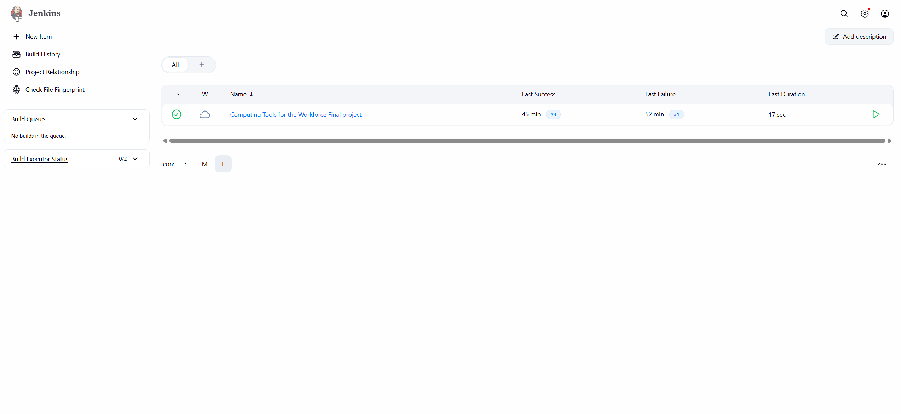
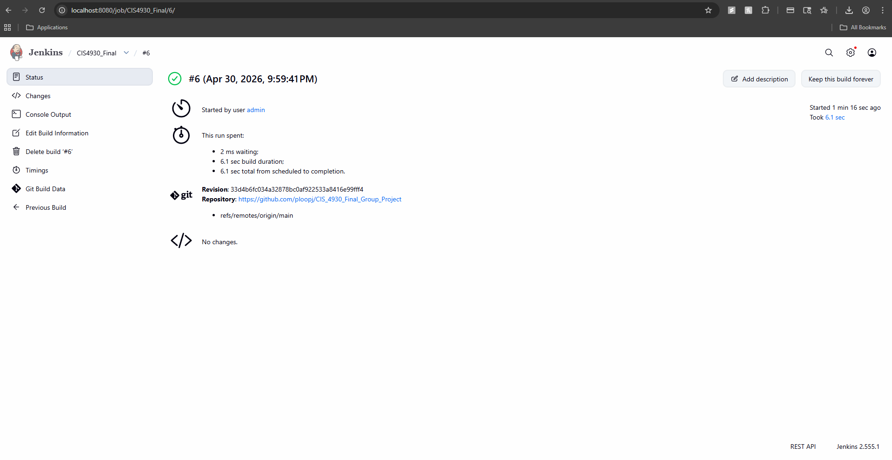
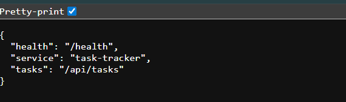
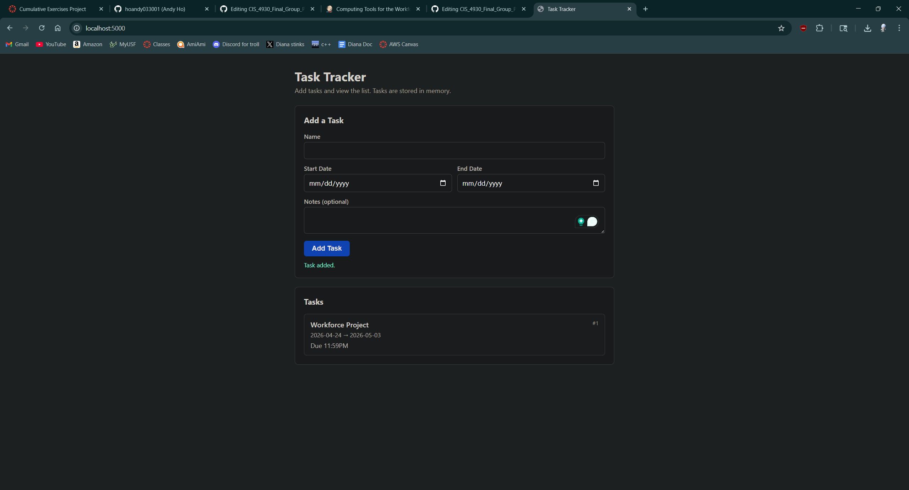

# CIS 4930 — Final project
REPO LINK: [CIS_4930_Final_Group_Project](https://github.com/ploopj/CIS_4930_Final_Group_Project
)

- Clement Joseph
- Roy Ibarra
- Andy Ho
- Sebastian Ramirez Gonzalez
- Rex Gonzalez

## Architecture
Flask was used for the backend of our project. Some endpoints used:

**API**

- `GET /api/tasks` — list tasks as JSON
- `POST /api/tasks` — send JSON: `name`, `start_date`, `end_date`, optional `notes`. Server adds `id`.
- `GET /health` — returns `{"status":"ok"}`

Bad requests get status `400` and `{"error":"..."}`.

Dates are plain strings (ISO-style is fine, e.g. `2026-05-01`).

HTML/CSS/JS was used for our frontend, and the code in the frontend connected to app.py.

## Tools used
- Git/GitHub
- Docker/Docker compose
- Jenkins
- Flask app for tasks (name, start/end dates, notes). Tasks are stored in memory only, so they disappear when the server restarts.
## Setup 
Jenkins was downloaded and tested on all group members' machines. We created a new item and used a pipeline to connect to this repository.
Once Jenkins is fully linked with our repository, it is now ready to automate the workflow of our project. Once Jenkins runs our project, we can access it 
with http://localhost:5000

## Workflow
1. **Trigger** — A Jenkins build starts the pipeline.

2. **Checkout** — Jenkins copies the repository into the workspace.

3. **Build** — `docker compose build` uses the `Dockerfile` to install dependencies and produce a container image of the application.

4. **Deploy** — `docker compose up -d` runs the container in the background and maps host port **5000** to the app.

5. **Verify** — After a short wait, the pipeline requests `http://localhost:5000/`. A successful response passes the build; a failure fails the build.

**Summary:** The pipeline automates *checkout → build image → run container → smoke test* so each change is built and checked the same way.
## Screenshots
### Jenkins Home Page

Jenkins home page that lists our project.

### Jenkins Build Page

Our Jenkins configuration is successfully running with our Jenkinsfile setup.

### Skeleton Page

This was our skeleton website that ran with all of our files. We will build off of this

### Task Tracker Project

This is our finalized project. It is a simple task tracker that lets you create a list of 
tasks to stay organized. Jenkins automates the process of running our code with the help of 
Docker.
